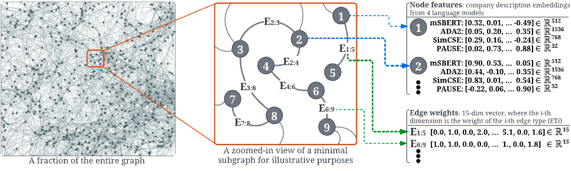

## A Large-Scale Heterogeneous Graph for Company Similarity Quantification and Relation Prediction

<div>
<p align="left">
  <a href="#setup">Setup</a> •
  <a href="#usage">Usage</a> •
  <a href="#results">Results</a> •
  <a href="https://zenodo.org/record/11391315">Dataset V2.0</a> •
  <a href="https://github.com/llcresearch/CompanyKG2/blob/main/tutorials/tutorial.ipynb">Operational Tutorial</a> •
  <a href="#training-benchmark-models">Training</a> •
  <a href="#cite-this-work">Citation</a> 
</p>

</div>

This repo contains source code for CompanyKG (version 2), a large-scale heterogeneous graph developed for fine-grained company similarity quantification and relationship prediction, crucial for applications in the investment industry such as market mapping, competitor analysis, and mergers and acquisitions. CompanyKG comprises 1.17 million companies represented as graph nodes, enriched with company description embeddings, and 51.06 million weighted edges denoting 15 distinct inter-company relations. To facilitate a thorough evaluation of methods for company similarity quantification and relationship prediction, we have created four annotated evaluation tasks: similarity prediction, competitor retrieval, similarity ranking, and edge prediction.


<div style="font-size: 12px; text-align: left; margin-top: -20px;"><i>Fig.1: A subgraph (center) of the heterogeneous undirected CompanyKG graph (left), where the numbered nodes represent distinct companies and the edges signify multi-dimensional inter-company relations. Node features and edge weights are exemplified on the right.</i></div>


## Setup

We recommend using Python 3.8. There are also optional dependencies, if you want to be able to convert the KG
to one of the data structures used by these packages:

* [DGL](https://pypi.org/project/dgl/): `dgl`
* [iGraph](https://pypi.org/project/python-igraph/): `python-igraph`
* [PyTorch Geometric (PyG)](https://pypi.org/project/torch-geometric/): `torch-geometric`

The `companykg` Python package provides a data structure to load CompanyKG into memory,
convert between different graph representations and run evaluation of trained embeddings
or other company-ranking predictors on three evaluation tasks. To install the `comapnykg` package and its Python dependencies, activate a virtual 
environment (such as [Virtualenv](https://github.com/pyenv/pyenv-virtualenv) or Conda) and run:

```bash
pip install -e .
```


## Usage

### Operational guide of CompanyKG V2.0

We recommend to simply follow the [tutorial](./tutorials/tutorial.ipynb).

### Training benchmark models

Implementations of various benchmark graph-based learning models are provided in this repository. To use them, install the `ckg_benchmarks` Python package, along with its dependencies, from the `benchmarks` subdirectory. First install `companykg` as above and then run:

```bash
cd benchmarks
pip install -e .
```

Further instructions for using the benchmarks package for model training and provided in
the [benchmarks README file](./benchmarks/README.md).

## Results
The main benchmarking results on SP, SR, CR and EP tasks are presented below.


<div style="font-size: 12px; text-align: left; margin-top: -20px;"><i>Tab.1: The performance of the popular and state-of-the-art baselines on three evaluation tasks of CompanyKG: SP, SR and CR which are compared with AUC, Accuracy (Acc.) and Recall@K respectively. Best results are in bold.</i></div>

<br>


<div style="font-size: 12px; text-align: left; margin-top: -20px;"><i>Tab.2: The benchmark results on EP (edge prediction) task measured by overall AUC and per-ET AUCs. Best results are in bold.</i></div>


## Cite This Work

Cite the paper that corresponds to CompanyKG V2:
```bibtex
@inproceedings{cao2024companykg2,
    author = {Lele Cao and
              Vilhelm von Ehrenheim and
              Mark Granroth-Wilding and
              Richard Anselmo Stahl and
              Drew McCornack and
              Armin Catovic and
              Dhiana Deva Cavacanti Rocha},
    title = {{CompanyKG2: A Large-Scale Heterogeneous Graph for Company Similarity Quantification}},
    booktitle = {Proceedings of the 2024 ACM SIGKDD International Conference on Knowledge Discovery and Data Mining},
    year = {2024}
}
```

Cite the [official release of the CompanyKG dataset V2.0 on Zenodo](https://zenodo.org/record/11391315):
```bibtex
@article{companykg_2024_11391315,
    author = {Lele Cao and
              Vilhelm von Ehrenheim and
              Mark Granroth-Wilding and
              Richard Anselmo Stahl and
              Drew McCornack and
              Armin Catovic and
              Dhiana Deva Cavacanti Rocha},
    title = {{CompanyKG Dataset V2.0: A Large-Scale Heterogeneous Graph for Company Similarity Quantification}},
    month = May,
    year = 2024,
    publisher = {Zenodo},
    version = {2.0},
    doi = {10.5281/zenodo.11391315},
    url = {https://doi.org/10.5281/zenodo.11391315}
}
```
